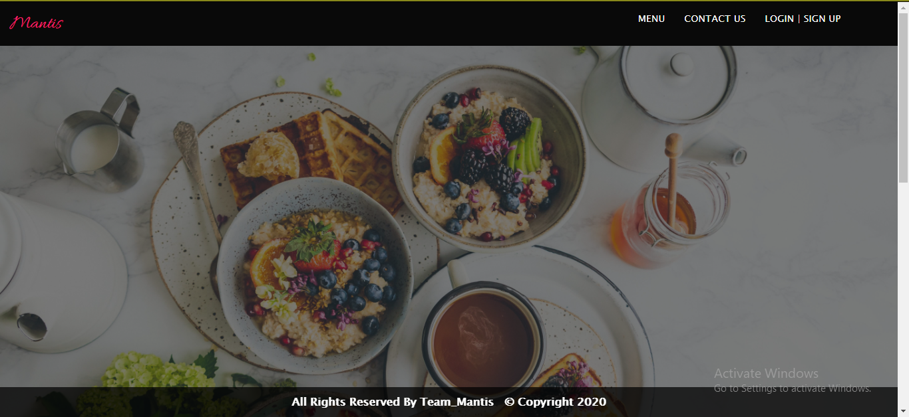
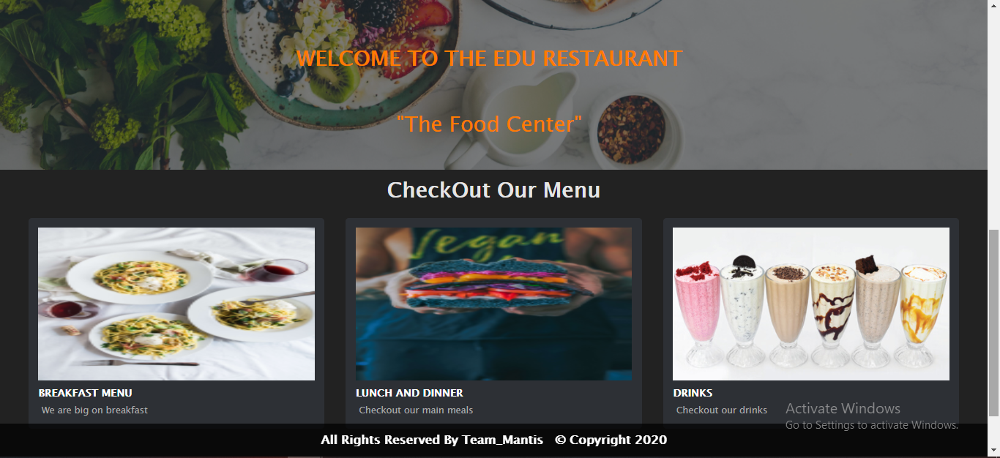
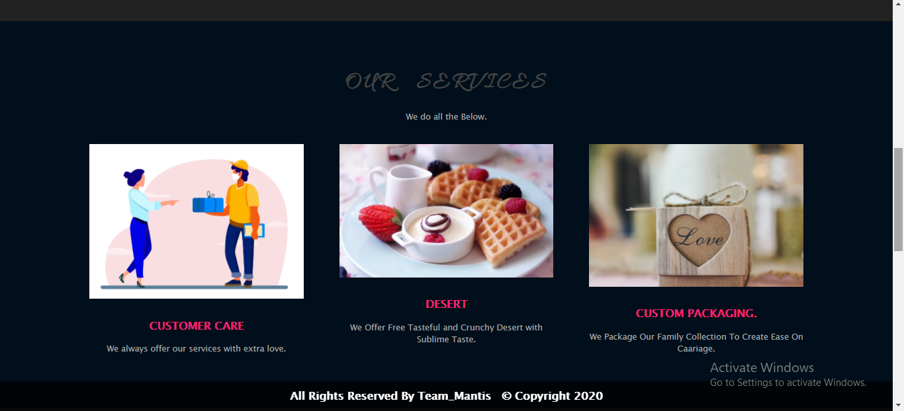

# Mantis

This Is A Edu Class Restaurant Menu Project Where we Were Assigned to Build a Restaurant Project With The Following Qualities.

EDU-Restaurant menu is an online platform where users can order for different types of foods and drinks
and get responses whether the chosen type of food of their choice is available or not.

                                                         PROJECT SAMPLES...

              PAGES & UI Designs.

